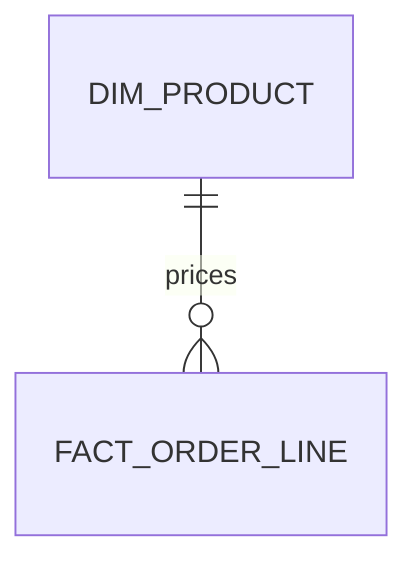

# Authoring reference

The source is GitHub-flavoured markdown, the Material for MkDocs conventions Zensical uses (admonitions, tabs), and three JSON diagram fences of our own. The template renders it client-side with marked. Anything marked does not understand passes through as raw HTML, so `<div class="grid">` markup works where needed.

## Structure

- `# Title`: exactly one. Becomes the title block (with front-matter description and byline) and the title slide.
- `## Section`: a section in doc mode, a slide in slides mode, an entry in the contents pane.
- `### Subsection`: nested under its section in the contents pane while that section is in view. Use `####` for small labelled runs inside a section; it renders as an uppercase eyebrow.
- Only H2 splits slides. Horizontal rules do not.

## Inline

Standard markdown: `**bold**`, `` `code` ``, links, lists, blockquotes, tables. Tables get a horizontal scroll container, so wide tables are fine. Keep numbers in tables, not prose.

## Code and output

````
```python title="tests/fixtures/gate_probe.py"
print(evaluate(rows, max_null_ratio=0.005))
```

```output
GateResult(passed=False, null_ratio=0.3333, threshold=0.005)
```
````

- The language is the first word after the fence; `title="..."` puts a filename in the card header.
- An ```` ```output ```` fence directly after a code fence attaches to it as the result strip. Anywhere else it renders as a standalone output card.
- This is the showboat format: `uv run showboat exec` writes these pairs. Generate them with showboat so `showboat verify` keeps them honest.
- Highlighting covers the highlight.js core languages plus SAS.

## Admonitions

```
!!! note "Scope"
    Body, indented four spaces. Markdown inside works, including code fences.

??? question "Why not fix it in the join?"
    Collapsed by default. Use `???+` to start open.
```

Types by colour role: `note`, `info`, `abstract`, `example` (accent or neutral); `tip`, `success` (good); `warning`, `caution` (warn); `danger`, `failure`, `bug` (bad); `question` (neutral). Omit the title to use the type name.

## Tabs

```
=== "SQL"
    ```sql
    select ...
    ```

=== "Python"
    ```python
    ...
    ```
```

Use tabs for the same idea in different languages or environments, never to hide unrelated content.

## Images and screenshots

```


```

- The builder resolves local paths relative to the markdown file and inlines them as data URIs. Keep images under a few hundred KB each; the page must stay under 16 MB.
- Alt text starting with `screenshot` puts the image in a browser frame. If the title starts with a URL, that URL goes in the address bar and the rest becomes the caption.
- Figures are numbered automatically. The caption says what to notice.

## Mermaid

````

````

Artifacts render `pre.mermaid` natively; a local file needs `--standalone`. Use mermaid for ERD, sequence, state, class, gantt and simple flowcharts. Use `flow` when the reader needs to click into data.

## `flow`: data-flow DAG with an inspector

````
```flow title="One order event moving through the enrichment API"
{
  "direction": "LR",            // LR (default) or TB
  "select": "join",             // optional: node open on load
  "nodes": [
    {"id": "events", "label": "order_events", "kind": "table",
     "note": "Raw Kafka payloads landed hourly.",
     "output": {"columns": ["order_id", "items"], "rows": [["o-1001", "[sku-1×2]"]]}},
    {"id": "join", "label": "Join dimensions", "kind": "api",
     "note": "Inline markdown is allowed here: `code`, **bold**, links.",
     "code_lang": "sql",
     "code": "SELECT ... LEFT JOIN dim_product USING (sku)",
     "input":  {"columns": ["order_id", "sku", "qty"],               "rows": [["o-1001", "sku-1", "2"]]},
     "output": {"columns": ["order_id", "sku", "qty", "unit_price"], "rows": [["o-1001", "sku-1", "2", "12.50"]]}}
  ],
  "edges": [
    {"from": "events", "to": "join", "label": "1 row / order"}
  ]
}
```
````

- `kind` picks the shape: `process` (rounded, default), `table` (header band), `store` (cylinder), `api` or `service` (accent bar), `decision` (diamond), `external` (dashed).
- Layout is automatic: longest-path layering, left to right or top to bottom. Nodes stack within a layer in JSON order.
- The inspector compares `input` to `output` by column name and row index. A column only in `output` is marked added, only in `input` dropped, and a cell whose value differs shows old→new. Keep the same entity in the same row position so the comparison means something; when a step changes cardinality, as an explode does, let the shape note (`3 × 5`) carry the change.
- Nodes without `input`, `output`, `note` or `code` are clickable but show nothing. That is fine for connectors.
- Values render as text. Pass numbers as strings to control formatting (`"12.50"`).
- JSON must be strict: double quotes, no trailing commas, no comments (the comments above are for this page only). The builder fails on invalid JSON or an edge naming an unknown node.

## `graph-diff`: before/after DAG

````
```graph-diff title="Lineage before and after the v2 cutover"
{
  "before_label": "v1 (snapshot)",
  "after_label": "v2 (live join + gate)",
  "direction": "LR",
  "before": {"nodes": [...], "edges": [...]},
  "after":  {"nodes": [...], "edges": [...]}
}
```
````

Nodes match by `id`, edges by `from`→`to`. A node or edge only in `before` is drawn removed (red, dashed) on the left; only in `after`, added (green) on the right; an edge whose `label` changed, amber on both sides. A legend and a `+n / −n` summary follow. Nodes accept the same fields as in `flow`, but the diff view is not clickable; put an inspectable version in a separate `flow` block.

## `table-diff`: before/after rows

````
```table-diff title="Replay of one batch through v1 and v2"
{
  "title": "fact_order_line, batch 2026-09-04T23",
  "key": ["order_id", "sku"],
  "before": {"columns": ["order_id", "sku", "unit_price"], "rows": [["o-1", "sku-1", "12.00"]]},
  "after":  {"columns": ["order_id", "sku", "unit_price"], "rows": [["o-1", "sku-1", "12.50"]]}
}
```
````

Rows match on `key` (a column name or a list; default the first column). Output is one table: added rows green, removed rows red with strikethrough, changed cells old→new in amber, a status column on the right, and a count summary. Columns only in `after` are marked added in the header, only in `before` dropped.

## Expanding figures

Every `flow`, `graph-diff`, `table-diff`, mermaid figure and screenshot gets an Expand button on hover. It opens the figure in a modal with zoom (`+`, `-`, `0` to fit) and scroll; `Esc` or Close returns it. Nothing to author.

## Speaker notes

````
```notes
Lead with the graph diff; the request flow is backup.
```
````

Hidden in doc mode. In slides mode press `n` to show the current slide's notes under it.

## Slides mode

- Header buttons switch between Document and Slides; the choice is remembered per browser.
- Keys: `→` `space` `PageDown` next, `←` `PageUp` previous, `Home` `End`, `n` notes.
- The URL hash tracks the current section, so a link to `#what-changed-in-v2` opens on that slide.
- Fit each section to one screen at 1280×720: one diagram plus a few lines, or one table, or one code card with output. Split otherwise.

## Grids (raw HTML)

```
<div class="grid">
<div class="card">

#### Reads
`order_events`, `dim_customer`

</div>
<div class="card">

#### Writes
`fact_order_line`

</div>
</div>
```

Blank lines around the markdown inside each card are required for marked to parse it.
